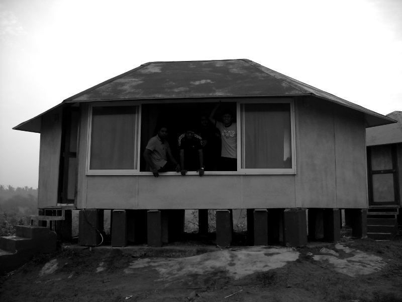
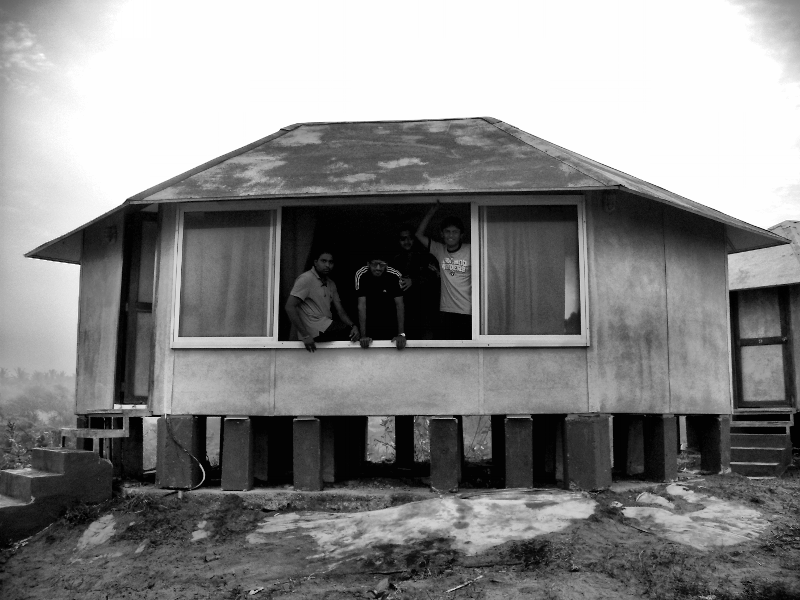

#  Contrast Limited Adaptive histogram equalization
Python implementation of CLAHE (paper: Pizer S. M. et al. Adaptive histogram equalization and its variations)
## Original image

## Apply CLAHE

